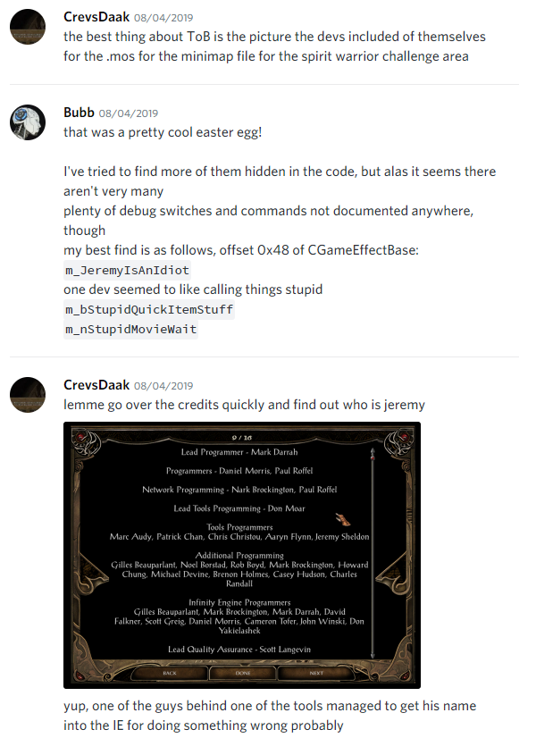
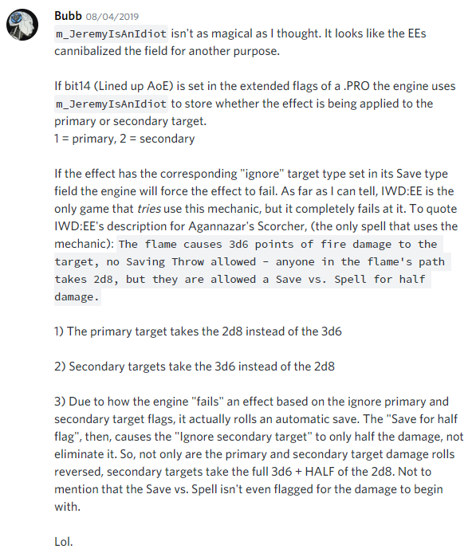
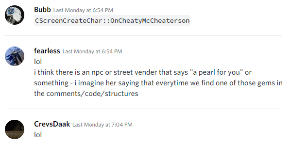
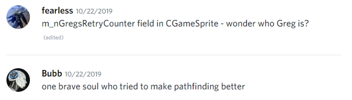
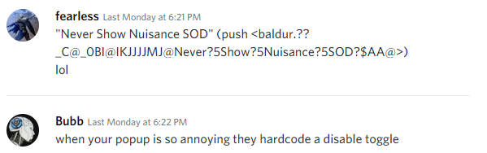
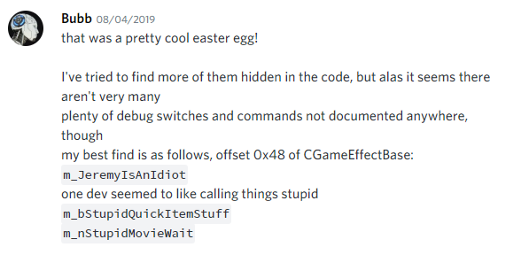
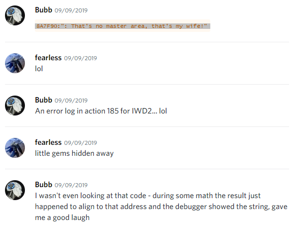
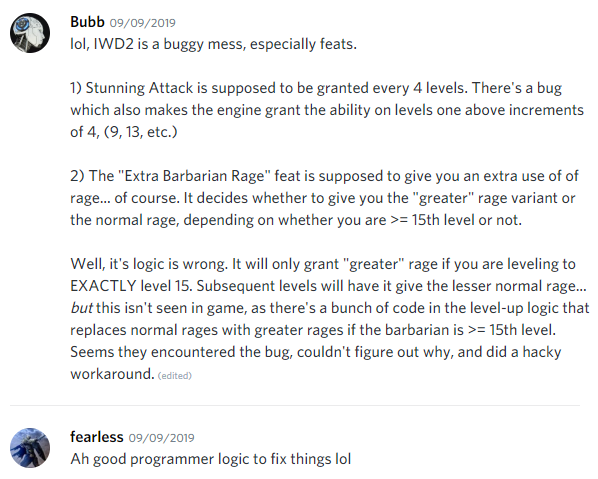

.. _A pearl to you:

==================
A pearl to you
==================

   "Greetings, good customer. A pearl to you."
   
   -- BG2EE: StrRef 38848: FEMER01.WAV
   
   
Whilst extracting debug symbol information located in .pdb files and from debugging the IE or EE game executables (using IDA, x64dbg, llvm-pdbutil and other tools), sometimes we come across comments, field names, function parameters or other oddities that make us laugh and wonder as to their origin and the story behind them. 

Some of these pearls of wisdom, gems of insight and nuggets of knowledge are highlighted here, along with some observations or thoughts on each "pearl".

Enjoy.

------------------
Jeremy is an idiot
------------------

Located at offset ``0x48`` of the :ref:`CGameEffectBase<CGameEffectBase>` structure is a field called **m_JeremyIsAnIdiot**

*Who is Jeremy? In the credits there is a Jeremy Sheldon, is this the same person? what did he do that immortalized his name into a field of a game structure?*

Source: Baldurs Gate II: Enhanced Edition - Baldur.pdb

-------------------
See jake about this
-------------------

Located on line ``166`` of Triggers.ids of IWD2 is a parameter called **SeeJakeAboutThis**

::

   0x40C6 NearbyDialog(S:DialogFileName*,I:SeeJakeAboutThis*)

*I guess no one got round to seeing Jake about it then*

.. image:: seejakeaboutthis.png

Source: Icewind Dale II - Triggers.ids

-------------------
Cheaty McCheaterson
-------------------

The :ref:`CScreenCreateChar class<CScreenCreateChar Class>` has a method named :ref:`CScreenCreateChar\:\:OnCheatyMcCheaterson<CScreenCreateCharOnCheatyMcCheaterson>`

*The lesser known cousin of Boaty McBoatyFace*

Source: Baldurs Gate II: Enhanced Edition - Baldur.pdb

-------------------
Try again Greg?
-------------------

Located at offset ``0x340C`` of the :ref:`CGameSprite<CGameSprite>` structure is a field named **m_nGregsRetryCounter**

Source: Baldurs Gate II: Enhanced Edition - Baldur.pdb

-------------------
SOD is a nuisance!
-------------------

An unused string reference or developer comment referenced at offset ``0x0067CB5F`` for the memory address ``0x008A2D6C`` in the BG2EE game executable, shows what the developers really thought about the hard coded SOD dialog popup, and they subsequently created a work around to never show it.

::

   0067CB5F | 68 6C2D8A00 | push <baldur.??_C@_0BI@IKJJJJMJ@Never?5Show?5Nuisance?5SOD?$AA@>

Part of the push instruction ``6C2D8A00`` refers to memory address ``0x008A2D6C``, at which is located:

::   
   
   008A2D6C:"Never Show Nuisance SOD"

Source: Baldurs Gate II: Enhanced Edition - Baldur.pdb

---------------------
Its just plain stupid
---------------------

Located at offset ``0x90`` of the :ref:`CGameOptions<CGameOptions>` structure is a field named **m_bStupidQuickItemStuff**

Located at offset ``0x2C`` of the :ref:`CScreenWorld<CScreenWorld>` structure is a field named **m_nStupidMovieWait**

Source: Baldurs Gate II: Enhanced Edition - Baldur.pdb

---------------------
The master area?
---------------------

A push instruction at offset ``0x0044FE90`` referencing a memory address at ``0x008A7F90`` in the IWD2 game executable, shows an interesting string:

::
   
   0044FE90 | 68 907F8A00 | push iwd2.8A7F90

Part of the push instruction ``907F8A00`` refers to memory address ``0x008A7F90``, at which is located:

::

   008A7F90:": That's no master area, that's my wife!"

Source: Icewind Dale II - IWD2.EXE

----------------------
Rage against the logic
----------------------

*Sometimes logic can get the better of us, and then we rage.*

Source: Icewind Dale II - IWD2.EXE
