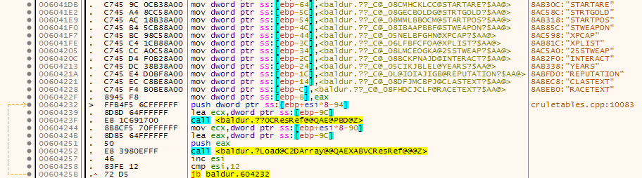

.. _C2DArray Class:

==========================
C2DArray Class
==========================

.. toctree::
   :maxdepth: 1

Implements a 2D (two dimensional) array for handling ``.2da`` text files that store game data (typically rules etc) in columns and rows. See `2DA file format <https://gibberlings3.github.io/iesdp/file_formats/ie_formats/2da.htm>`_ for details.

The structure used for this class is :ref:`C2DArray<C2DArray>`

+---------------------------------------------------------------------------------------------------------------------------------------------------------------------------------+
| **Quick Ref**                                                                                                                                                                   |
+---------------------------------------------------------------------------------------------------------------------------------------------------------------------------------+
| unsigned char **C2DArray\:\:Find**\(:ref:`CString<CString>`\& sSearchString, :ref:`CString<CString>`\& sXLabel, :ref:`CString<CString>`\& sYLabel, unsigned char bSearchLabels) |
+---------------------------------------------------------------------------------------------------------------------------------------------------------------------------------+
| unsigned char **C2DArray\:\:Find**\(:ref:`CString<CString>`\& sSearchString, :ref:`CPoint<CPoint>`\& ptLocation, unsigned char bSearchLabels)                                   |
+---------------------------------------------------------------------------------------------------------------------------------------------------------------------------------+
| :ref:`CString<CString>`\& **C2DArray\:\:GetAt**\(:ref:`CString<CString>`\& nX, :ref:`CString<CString>`\& nY)                                                                    |
+---------------------------------------------------------------------------------------------------------------------------------------------------------------------------------+
| const long **C2DArray\:\:GetAtLong**\(:ref:`CPoint<CPoint>`\& coordinates)                                                                                                      |
+---------------------------------------------------------------------------------------------------------------------------------------------------------------------------------+
| void **C2DArray\:\:Load**\(:ref:`CResRef<CResRef>`\& res)                                                                                                                       |
+---------------------------------------------------------------------------------------------------------------------------------------------------------------------------------+
| void **C2DArray\:\:LoadLines**\(:ref:`CResRef<CResRef>`\& res)                                                                                                                  |
+---------------------------------------------------------------------------------------------------------------------------------------------------------------------------------+
| void **C2DArray\:\:~C2DArray**\()                                                                                                                                               |
+---------------------------------------------------------------------------------------------------------------------------------------------------------------------------------+

----

---------------
Constructors
---------------

+----------------------------------------------------------+------------------------------------------------------+
| **Name**                                                 | **Description**                                      |
+----------------------------------------------------------+------------------------------------------------------+
| :ref:`C2DArray\:\:~C2DArray<C2DArray~C2DArray>`          | Destroys a ``C2DArray`` object                       |
+----------------------------------------------------------+------------------------------------------------------+

.. _C2DArray~C2DArray:

C2DArray\:\:~C2DArray
^^^^^^^^^^^^^^^^^^^^^

Destroys the ``C2DArray`` object.

::

   ~C2DArray();

**Remarks**

Destroys the ``C2DArray`` object.

----

---------------
Methods
---------------

+----------------------------------------------------------+-----------------------------------------------------------------------------------------+
| **Name**                                                 | **Description**                                                                         |
+----------------------------------------------------------+-----------------------------------------------------------------------------------------+
| :ref:`C2DArray\:\:Find<C2DArrayFind>`                    | Locate a text value in the 2da array using column and row text headers to limit search  |
+----------------------------------------------------------+-----------------------------------------------------------------------------------------+
| :ref:`C2DArray\:\:GetAt<C2DArrayGetAt>`                  | Return a text value from the specified x and y coords of the 2da array                  |
+----------------------------------------------------------+-----------------------------------------------------------------------------------------+
| :ref:`C2DArray\:\:GetAtLong<C2DArrayGetAtLong>`          | Return a long integer value from the specified x and y coords of the 2da array          |
+----------------------------------------------------------+-----------------------------------------------------------------------------------------+
| :ref:`C2DArray\:\:Load<C2DArrayLoad>`                    | Load a 2da resource into the C2DArray class                                             |
+----------------------------------------------------------+-----------------------------------------------------------------------------------------+
| :ref:`C2DArray\:\:LoadLines<C2DArrayLoadLines>`          | Load a 2da resource into the C2DArray class                                             |
+----------------------------------------------------------+-----------------------------------------------------------------------------------------+

.. _C2DArrayFind:

C2DArray\:\:Find
^^^^^^^^^^^^^^^^^^^^^

Locates a text value in the 2da array using column and row text headers to limit search.

::

   unsigned char C2DArray::Find(
      CString& sSearchString, 
      CString& sXLabel, 
      CString& sYLabel, 
      unsigned char bSearchLabels);

**Parameters**

* :ref:`CString<CString>`\& *sSearchString* - text string to search for
* :ref:`CString<CString>`\& *sXLabel* - column to search
* :ref:`CString<CString>`\& *sYLabel* - row to search
* ``unsigned char`` *bSearchLabels* - search among labels for sSearchString

**Return Value**

Returns the result of the search as an unsigned char. 

**Remarks**

*bSearchLabels* can be set to ``TRUE`` to search labels.

----

C2DArray\:\:Find
^^^^^^^^^^^^^^^^^^^^^

Locate a text value in the 2da array using x and y coords to limit search

::

   unsigned char C2DArray::Find(
      CString& sSearchString, 
      CPoint& ptLocation, 
      unsigned char bSearchLabels);

**Parameters**

* :ref:`CString<CString>`\& *sSearchString* - text string to search for
* :ref:`CPoint<CPoint>`\& *ptLocation* - x and y coordinates to search
* ``unsigned char`` *bSearchLabels* - search among labels for sSearchString

**Return Value**

Returns the result of the search as an unsigned char.

**Remarks**

*bSearchLabels* can be set to ``TRUE`` to search labels.

----

.. _C2DArrayGetAt:

C2DArray\:\:GetAt
^^^^^^^^^^^^^^^^^^^^^

Get a text value from the specified x and y coordinates

::

   CString& C2DArray::GetAt(
      CString& nX, 
      CString& nY);

**Parameters**

* :ref:`CString<CString>`\& *nX* - x coordinate to get the text value from
* :ref:`CString<CString>`\& *nY* - y coordinate to get the text value from

**Return Value**

Returns the text value as :ref:`CString<CString>`\&

----

.. _C2DArrayGetAtLong:

C2DArray\:\:GetAtLong
^^^^^^^^^^^^^^^^^^^^^

Get a numeric value from the specified x and y coordinates

::

   const long C2DArray::GetAtLong(
      CPoint& coordinates);

**Parameters**

* :ref:`CPoint<CPoint>`\& *coordinates* - x and y coordinates to get the numeric value from

**Return Value**

Returns the numeric value as a long integer 

----

.. _C2DArrayLoad:

C2DArray\:\:Load
^^^^^^^^^^^^^^^^^^^^^

Loads the specified 2da resource

::

   void C2DArray::Load(
      CResRef& res);

**Parameters**

* :ref:`CResRef<CResRef>`\& *res* - resource reference of the 2da file to load

**Remarks**

The disassembly below shows the following:

* in a loop, loading of 17 strings and turning them into resource references with the ``CResRef::CResRef`` class method
* passing the newly created CResRef (resource reference) to the ``C2DArray::Load`` class method to load the specified .2da file resource
* note: esi is compared to 18 decimal (0x12) and continues the loop is below that value: ``cmp esi,12``, ``jb baldur.604232``

The equivalant in C++ might be:

::

   string 2dalist[18] = {"LOADHINT", "MASTAREA", "NPCLEVEL", "TBPPARTY", "PDIALOG", "STARTARE", "STRTGOLD", "STARTPOS", "STWEAPON", "XPCAP", "XPLIST", "25STWEAP", "INTERACT", "YEARS", "REPUTATION" ,"CLASTEXT", "RACETEXT"}; 

   CResRef ref;
   C2DArray array;
   
   
   for (int i = 0; i < 18; i++)
   {
      CResRef ref((const char*)2dalist[i]);
      array.Load(ref);
   }

----

.. _C2DArrayLoadLines:

C2DArray\:\:LoadLines
^^^^^^^^^^^^^^^^^^^^^

Loads the specified 2da resource

::

   void C2DArray::LoadLines(
      CResRef& res);

**Parameters**

* :ref:`CResRef<CResRef>`\& *res* - resource reference of the 2da file to load

