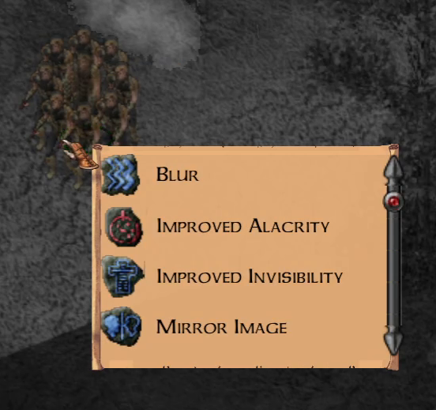
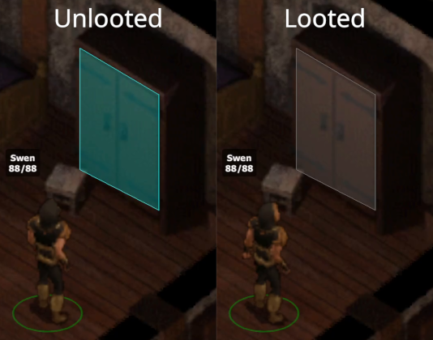
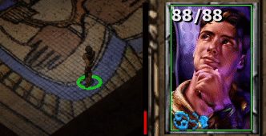
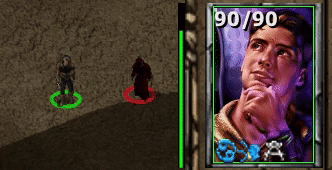
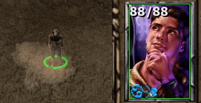

.. _Components:

==========
Components
==========

* :ref:`EEex<EEex>`
* :ref:`Experimental - Use LuaJIT<LuaJIT_component>`
* :ref:`Enable effect menu module<effect_menu_module>`
* :ref:`Enable empty container module<empty_container_module>`
* :ref:`Enable timer module<timer_module>`
* :ref:`Timer module - Show modal actions<timer_module_modals>`
* :ref:`Timer module - Show contingencies<timer_module_contingencies>`
* :ref:`Timer module - Show spell/item cooldowns<timer_module_spells_and_items>`
* :ref:`Enable time step module<time_step_module>`
* :ref:`Enable hotkey module<hotkey_module>`

.. _EEex:

EEex
----

The main component of EEex. This includes most functionality required by mods that depend on EEex. There are no user-side effects of this component.

.. _LuaJIT_component:

Experimental - Use LuaJIT
-------------------------

This component replaces the Lua version used by the engine with `LuaJIT <https://luajit.org/luajit.html>`_.

LuaJIT is a faster implementation of Lua; replacing the engine's Lua version with LuaJIT can help alleviate performance issues.

.. warning::
   The engine was **not designed** to use LuaJIT. This component is currently experimental, and may introduce crashes / errors in mod-introduced
   Lua code that otherwise works under the engine's normal Lua version.

.. _effect_menu_module:

Enable effect menu module
-------------------------

This component enables the effect menu. A menu displaying all the spells currently affecting a creature can be invoked by holding L-Shift and hovering over said creature.

Note that this menu is dynamically generated - it does the best it can, though there are holes in what it can detect, and it may show internal spells at times.

.. _empty_container_module:

Enable empty container module
-----------------------------

This component changes the highlight color of empty containers to gray (replacing the normal cyan).

.. _timer_module:

Enable timer module
-------------------

This module enables visual indicators next to party member portraits that display various timer information. This component has no effect alone. See the following components
for more information.

.. _timer_module_modals:

Timer module - Show modal actions
---------------------------------

This component enables a red bar next to party member portraits. This indicator displays the interval of modal actions: find traps, turn undead, etc.

.. _timer_module_contingencies:

Timer module - Show contingencies
---------------------------------

This component enables a green bar next to party member portraits. This indicator displays the interval at which contingency conditions are checked.

Note that some mods add contingency effects behind-the-scenes to implement certain behaviors - this may cause the contingency indicator to appear unexpectedly.

.. _timer_module_spells_and_items:

Timer module - Show spell/item cooldowns
----------------------------------------

This component enables a cyan bar next to party member portraits. This indicator displays the cooldown for using spells / items.

.. _time_step_module:

Enable time step module
-----------------------

This component enables a keybinding, (by default 'd'), that when the game is paused, advances time by the minimum amount.
The key essentially causes the game to unpause and then pause again extremely quickly.
Additionally, holding the key for half a second makes time flow until it is released.

To change the keybinding, open ``override/B3TimeStep.lua`` and alter the following line:

.. code-block:: lua

   B3TimeStep_Key = EEex_Key_GetFromName("d")

.. image:: time_step.gif

*Also pictured: Bubb's Spell Menu - Overlay Mode*

.. _hotkey_module:

Enable hotkey module
--------------------

This component enables the ``override/B3Hotkey.lua`` file, which can be edited to create spell casting hotkeys that support
multi-key sequences and modifier keys. The top of the file includes examples which demonstrate how the keybindings are defined.

Note that when this module is enabled, by default the backtick (`) key toggles keycode printouts. When this toggle is enabled, any time a key
is pressed EEex will output the pressed key's keycode to the combat log. This keybinding can be changed or disabled in ``override/B3Hotkey.lua``.
